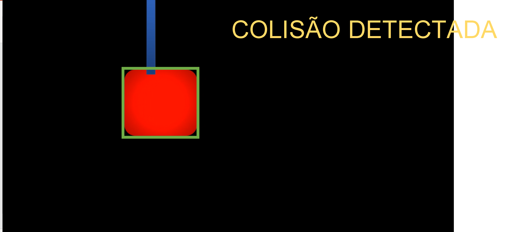
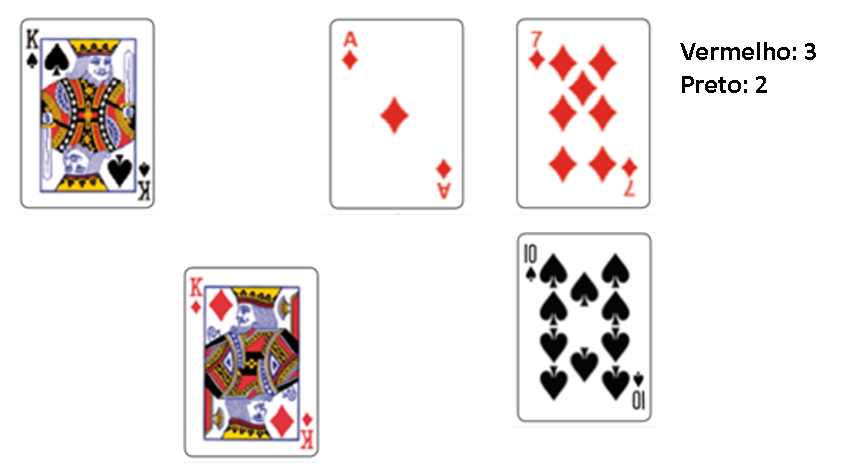
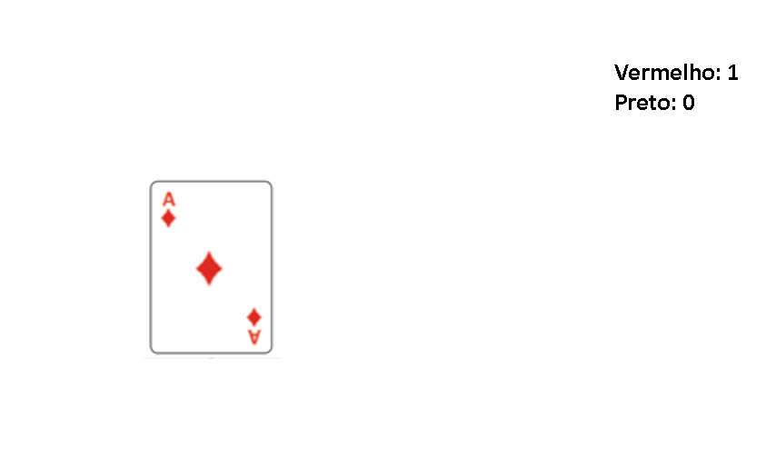

# AI ENGINEERING, COGNITIVE AND SEMANTIC COMPUTATION & IOT

## PS - 1 Semestre

**Prova prática em grupo com consulta.**

Nome:___________________________________________________

RM:_________________ 

Observações da avaliação nesta disciplina:

* A prova é prática, com o objetivo de avaliar sua compreensão relacionado ao conteúdo ministrado pela disciplina. 
* A prova é em grupo
* É permitido consulta a todo material pessoal (suas anotações, códigos) e público (github e internet).
* Ponha o seu nome no enunciado da prova
* Todos os códigos fornecidos estão executando perfeitamente.
* Entregue código que executa, código que não executa é zero!
* A responsabilidade por ter o *setup* funcionando é de cada estudante
* Os exercícios admitem diversas estratégias de resolução. A prova de cada aluno é única.
* Casos intermediários ou omissos da rubrica serão decididos pelo professor.

* A leitura e interpretação das questões faz parte da avaliação.

* Boa prova!

# Questões

Inspirado no contexto do Metaverso para crianças, vamos utilizar visão computacional para criar dois jogos.

## Questão 1  (5 pontos)

Você deve fazer um programa que detecta a colisão entre as formas geométricas. 

### Orientações

Você vai trabalhar no arquivo `q1/q1.py`. com o vídeo `q1A.mp4` ou `q1B.mp4`que já estão no diretório.

O vídeo para prova tem como base a soma de todos os dígitos do RM de todos os componentes do grupo:

|Soma RM | Video|
|--------|------| 
|De 1 até 5 | q1A|
|De 6 até 9 | q1B|

Exemplo: RM090174,RM0224,.. = 0+9+0+1+7+4 + 0+2+2+4... = 29=> 2+9 = 11 => 1+1 = 2 usar o víideo q1A

### O que você deve fazer:

Fazer o programa que devolve um output visual de acordo com a rubrica. 

Atenção: Não pode usar Template Matching, Feature Detection, Machine Learing ou Deep Learning.

### Rubrica

O que é esperado para cada rubrica:

|Resultado| Conceito| 
|----------|--------|
|R0 – Não executa | 0 |
|R1 – Detecta todas as formas geométrica por cor e produz saída visual demonstrando | 1 |
|R2 – Identifica a forma geométrica de maior massa com um retângulo verde em output visual | 2 |
|R3 – Detecta colisão entre as formas geométricas e identifica escrevendo no output visual “COLISÃO DETECTADA” | 4 |
|R4 – Identifica e exibe que a forma geométrica de maior massa ultrapassou completamente a outra forma geométrica | 5 |

Casos intermediários ou omissos da rubrica serão decididos pelo professor.

#### Dica: 

É esperado como output visual para a R1/R2, resultado do cálculo de massa com o retângulo em verde.

É esperado como output visual para a R3, resultado da detecção de colisão.

É esperado como output visual para a R4, resultado indicando que ultrapassou a barreira .

Se você precisar gerar mais de uma imagem de `debug` para demonstrar como seu programa funciona, as exiba usando a função `cv2.imshow`.

## Questão 2  (5 pontos)

Você deve fazer um programa que realiza a contagem de cartas vermelhas e cartas pretas que aparecem na tela.

### Orientações

Você vai trabalhar no arquivo `q2/q2.py` com o vídeo `q2.mp4` que já está no diretório.

### O que você deve fazer:

Fazer o programa que devolve um output visual de acordo com a rubrica. 

### Rubrica

O que é esperado para cada rubrica:

|Resultado| Conceito| 
|----------|--------|
|R0 – Não executa | 0 |
|R1 – Segmenta por cor ao menos 1 tipo de carta (as cartas vermelhas ou cartas pretas) e produz saída visual demonstrando | 2 |
|R2 – Segmenta por cor todas as cartas vermelhas e todas as cartas pretas e produz output visual | 3 |
|R3 – Conta a quantidade de cartas vermelhas e cartas pretas e identifica escrevendo no output visual “Vermelho: xx, Preto: yy” onde xx e yy representam a quantidade de cartas respectivamente | 5 |

Casos intermediários ou omissos da rubrica serão decididos pelo professor.

#### Dica: 

Como exemplo de output visual:

resultado esperado para 3 cartas vermelhas e 2 cartas pretas.

resultado esperado para 1 carta vermelha e 0 carta preta.

Se você precisar gerar mais de uma imagem de `debug` para demonstrar como seu programa funciona, as exiba usando a função `cv2.imshow`.

